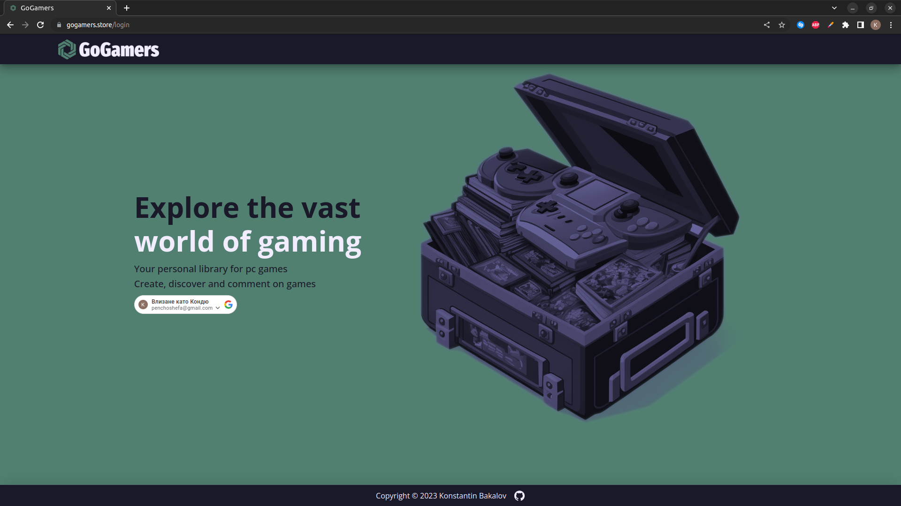
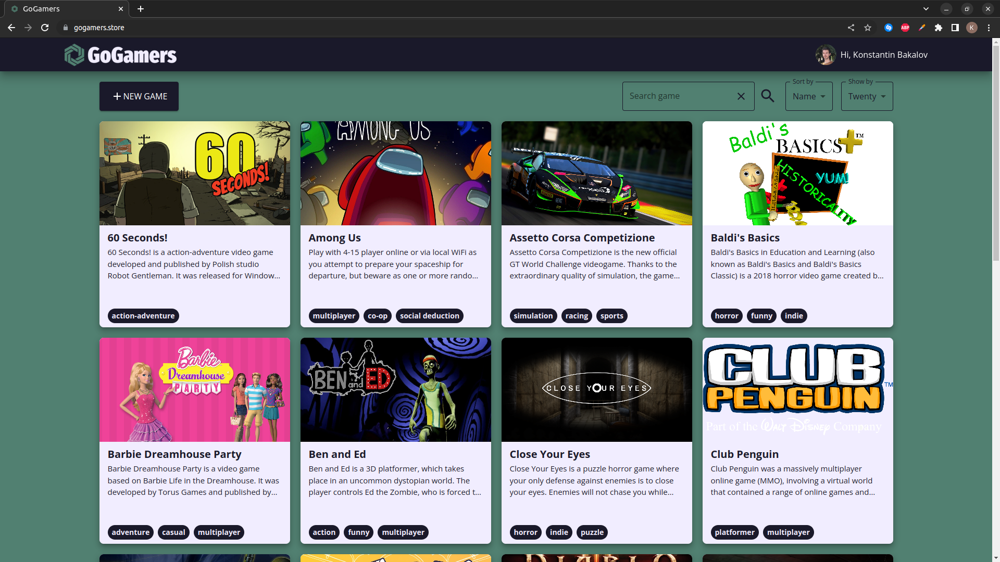
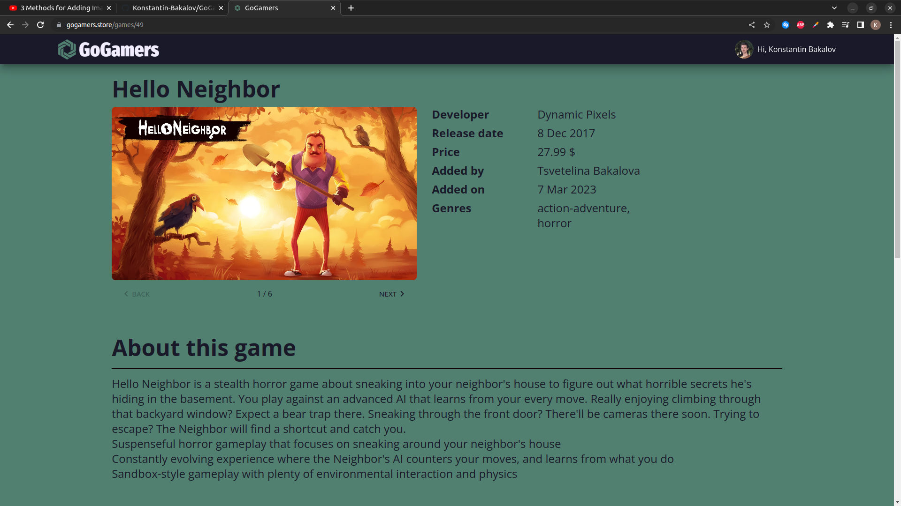
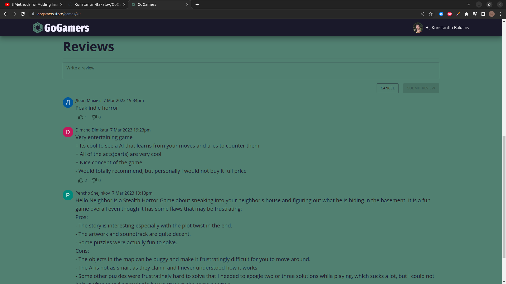

# GoGamers

- Your personal library for pc games. Create, discover and comment on games.

- Live demo https://go-gamers.onrender.com/ (need a gmail account to log in)

## Preview









## Features

- Responsive design
- Pagination
- Google login button
- Support for images and videos
- Create, edit, delete, view games
- Leave and rate comments (likes and dislikes shown)

## Tech Stack

**Client:** React, MaterialUI, Typescript, CSS

**Server:** PostgreSQL, Node, Express, Typescript, JWT, Objection.js, Zod, Knex

**Others:** Prettier, ESLint

## Deployment on AWS

The client is deployed using ngrok. The server runs on render.com. Images and videos are stored in Cloudinary.

## Environment Variables

To run this project, you will need to add the following environment variables to your .env file

**Client:**

`REACT_APP_SERVER_URL`

`REACT_APP_GOOGLE_BUTTON_API`

**Server:**

`DB_NAME`, `DB_USER`, `DB_PASSWORD`, `DB_HOST`, `DB_PORT`, `SERVER_PORT`,

`AWS_BUCKET_NAME`, `AWS_BUCKET_REGION`, `AWS_BUCKET_ACCESS_KEY`,`AWS_BUCKET_SECRET_KEY`

`JWT_KEY`

## Installation

Install using npm

```bash
  cd client && npm i
  npm start
```

Runs the app in the development mode.\
Open [http://localhost:3000](http://localhost:3000) to view it in the browser.

```bash
  cd server && npm i
  npm run db:up
  npm start
```

Install dependencies and run all migrations.
Remember to create a database and set env variables beforehand.
